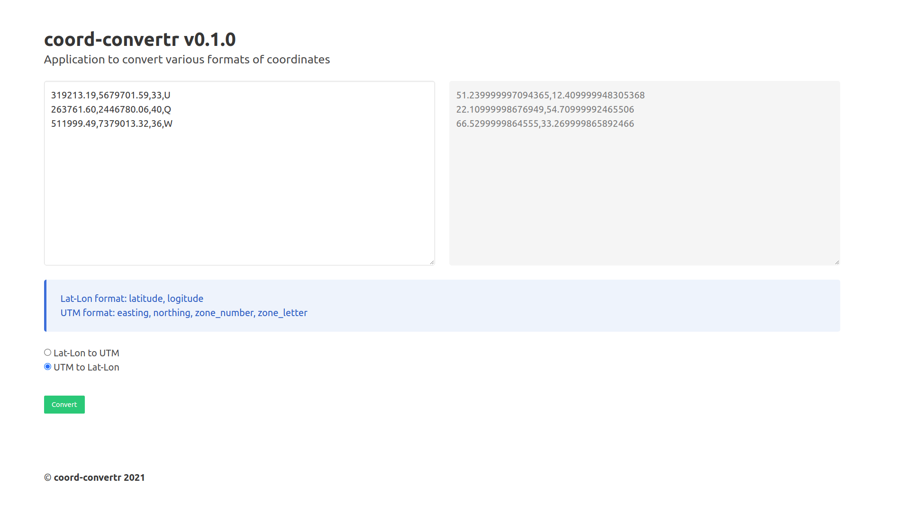

# Coord Convertr
Application to convert various formats of coordinates.


## Running the Application
```bash
pip install -r requirements.txt
python main.py
```

Graphical User Interface (GUI) available at https://0.0.0.0:8888
OpenAPI Spec (Swagger UI) available at https://0.0.0.0:8888/api

## Testing the Application
```bash
pip install pytest
pytest
```

## GUI Specification

Sample screenshot:


### Input formats
GUI takes input in csv where each row contains a coordinate in the following format:
- Lat-Lon format: `latitude, logitude`
```
51.24,12.41
22.11,54.71
66.53,33.27
```
- UTM format: `easting, northing, zone_number, zone_letter`
```
319213.19,5679701.59,33,U
263761.60,2446780.06,40,Q
511999.49,7379013.32,36,W
```

## API Specification
### Routes
- `/api/latlon-to-utm` (to convert from latlong to UTM format)
- `/api/utm-to-latlon` (to convert from UTM to latlong format)

### Models

```python
class LatLonCoord(BaseModel):
    latitude: float
    longitude: float

class UTMCoord(BaseModel):
    easting: float
    northing: float
    zone_number: int
    zone_letter: str
```

